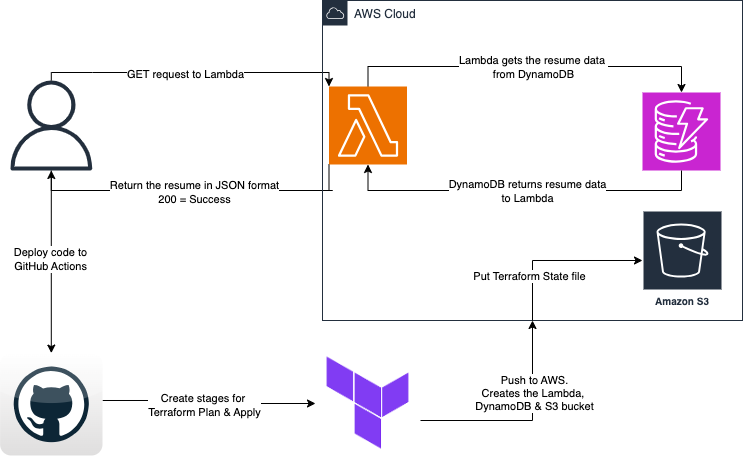

## Cloud Resume API
A project where I will build and deploy a serverless API using AWS Lambda and DynamoDB, integrated with GitHub Actions. 

## Primary goal?
- Construct an API that can serve resume data in a JSON format hosed in AWS

## Services used
- S3 bucket: Stores state file per best Terraform practices
- DynamoDB Table: Stores the resume in JSON format
- Lambda Function (Python): Fetches and displays the resume data in json format from the DynamoDB Table
- Github Actions: CI/CD pipeline to build infrastructure through Terraform when triggered

# Project Architecture

# Lambda function URL
- This function URL will display the resume JSON data, ensuring API calls are valid and a secure serverless connection is established for the client.

https://dl3dtvigb6asdlitgnxgqrl65i0fdtmv.lambda-url.us-east-1.on.aws/