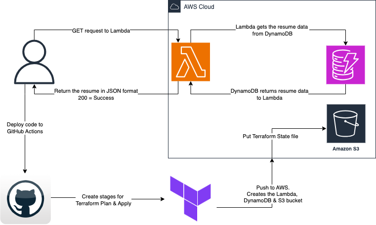

## Cloud Resume API
A project where I will build and deploy a serverless API using AWS Lambda and DynamoDB, integrated with GitHub Actions. 

## Primary goal?
- Construct an API that can serve resume data in a JSON format hosed in AWS

## Services used
- S3 bucket: Stores state file per best Terraform practices
- DynamoDB Table: Stores the resume in JSON format
- Lambda Function (Python): Fetches and displays the resume data in json format from the DynamoDB Table
- Github Actions: CI/CD pipeline to build infrastructure through Terraform when triggered

# Project Architecture


# Lambda function URL
- This function URL will display the resume JSON data, ensuring API calls are valid and a secure serverless connection is established for the client.

Link: https://dl3dtvigb6asdlitgnxgqrl65i0fdtmv.lambda-url.us-east-1.on.aws/

# Local deployment
## Pre-reqs
- An AWS Account (if you don't have one, read the doc found [here](https://docs.aws.amazon.com/accounts/latest/reference/manage-acct-creating.html) to install it!)
- Terraform CLI (if don't have it, read the doc found [here](https://developer.hashicorp.com/terraform/tutorials/aws-get-started/install-cli) to install it!)
- AWS CLI (if you don't have it, read the doc found [here](https://docs.aws.amazon.com/cli/latest/userguide/getting-started-install.html) to install it!)

### Step 1:
- Create the Dynamo DB, S3 bucket & Lambda function using the Terraform pipeline (remember to assign permissions to the Lambda role to read from DynamoDB)

### Step 2: Add Resume Data to the resume database
- ```zsh 
    aws dynamodb put-item \
    --table-name <your-table-name> \
    --item file://resume.json 
    ```

### Step 3: Retrieve the item to verify resume data is correct
- ```zsh
    aws dynamodb get-item \
  --table-name <your-table-name> \
  --key '{"id": {"S": "1"}}' 
  ``` 

### Step 4: Verify your Lambda function URL is working as expected
